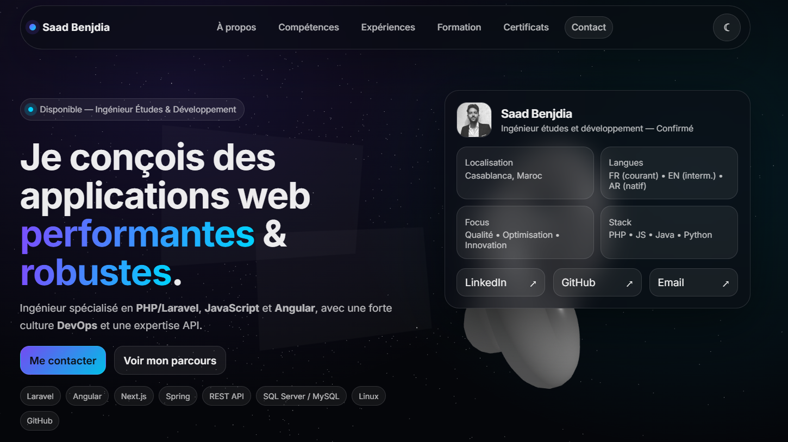

<h1 align="center">🚀 SaadFolio — Laravel + 3D Portfolio</h1>

  A modern <b>3D interactive</b> portfolio built with <b>Laravel 10</b>.
   
  One-page sections: Presentation • About • Skills • Experiences • Certificates • Contact

  <a href="#-demo">Demo</a> •
  <a href="#-features">Features</a> •
  <a href="#-tech-stack">Tech Stack</a> •

  
  
  

---

## 👋 About

**SaadFolio** is a clean and fast **one-page portfolio** with **3D UI effects** (tilt, depth, smooth reveal animations).
It’s powered by **Laravel 10** to make future improvements easy (admin, APIs, dynamic content, emails).

---

## 🌐 Demo

---
## ✨ Features

- ✅ One-page layout (Presentation, About, Skills, Experiences, Certificates, Contact)
- ✅ 3D effects (tilt / perspective) + smooth scroll reveal
- ✅ Responsive design (mobile/tablet/desktop)
- ✅ Social links (GitHub, LinkedIn, Email, WhatsApp)
- ✅ Contact form (mailto) *(can be upgraded to Laravel Mail)*
- ✅ Easy to customize (Blade / config)
- ✅ Ready for SEO basics (meta tags)

---

## 🧱 Tech Stack

- **Backend**: Laravel 10
- **Frontend**: Blade + HTML + CSS + JavaScript
- **Animations**: CSS 3D transforms + JS (IntersectionObserver)
- **Database**:  MySQL